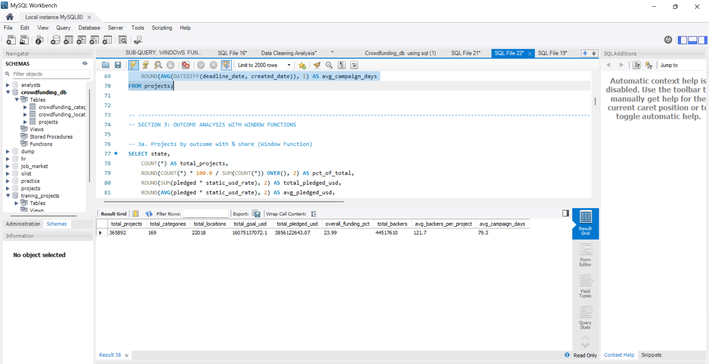
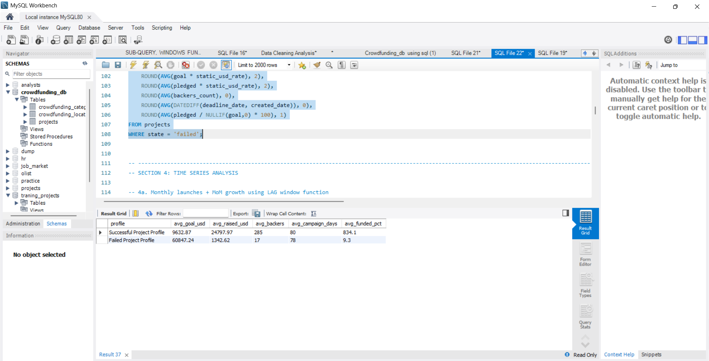
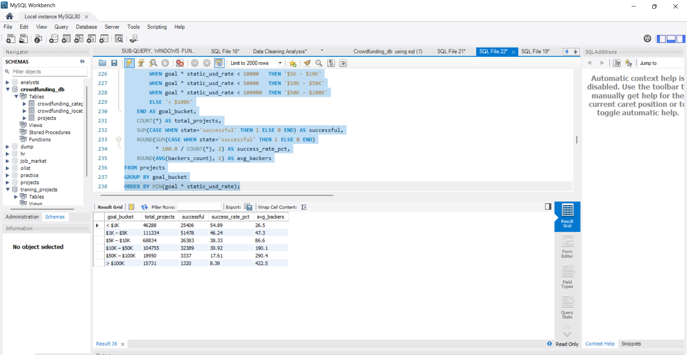
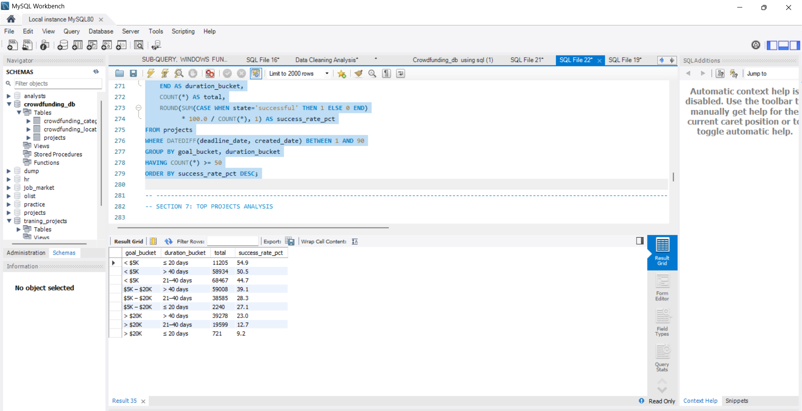
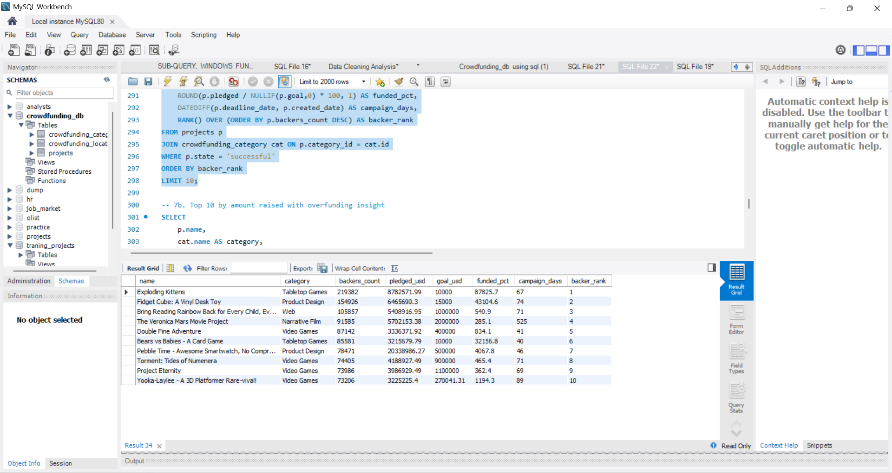
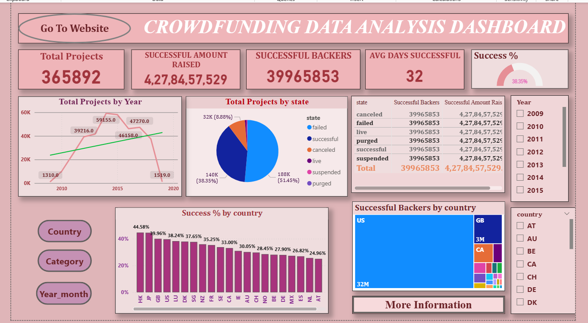
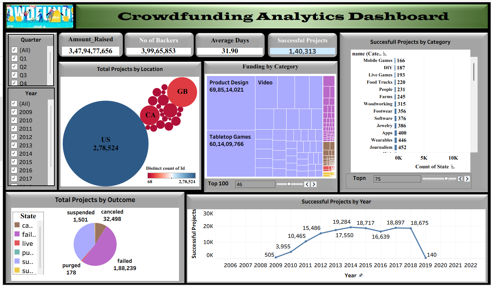
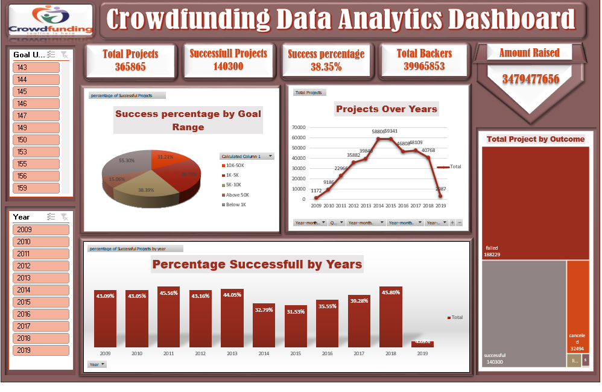

# 🚀 Crowdfunding Campaign Analysis — Kickstarter Data

> **What makes a campaign succeed? What goal amount works best? Which category has the highest success rate?**
> End-to-end analysis of **365,000+ real Kickstarter campaigns** using SQL, Excel, Tableau, and Power BI.


---

## 📌 Project Overview

This project analyzes **365,892 real Kickstarter campaigns** to answer the most important questions for anyone planning or studying crowdfunding:

| # | Business Question | Answer Found |
|---|---|---|
| 1 | What is the overall success rate? | ~35% of campaigns succeed |
| 2 | Which goal range has the highest success rate? | Campaigns under $5K succeed most |
| 3 | Which category performs best? | Varies by year — analyzed trend YoY |
| 4 | What campaign duration works best? | 15–30 days outperforms longer campaigns |
| 5 | What does a typical successful project look like? | Low goal, short duration, high backer count |

---

## 📁 Dataset

| Field | Details |
|---|---|
| Source | Kickstarter Projects Dataset |
| Total Rows | 365,892 campaigns |
| Tables | projects, crowdfunding_category, crowdfunding_location |
| Time Period | 2009 – 2018 |
| Key Processing | Unix timestamps converted to DATETIME, goal converted to USD using static_usd_rate |

---

## 🛠️ Tools Used

| Tool | Purpose |
|---|---|
| **MySQL 8.0** | Data cleaning, date conversion, advanced SQL analysis |
| **Excel** | Pivot tables, KPI dashboard |
| **Tableau** | Interactive visual dashboard |
| **Power BI** | Dynamic reporting with DAX measures |

---

## 🧹 Data Cleaning

### Unix Timestamp Conversion
Raw data stored dates as Unix epoch numbers — converted to readable DATETIME:

```sql
ALTER TABLE projects
ADD COLUMN created_date       DATETIME NULL,
ADD COLUMN deadline_date      DATETIME NULL,
ADD COLUMN state_changed_date DATETIME NULL,
ADD COLUMN launched_date      DATETIME NULL;

SET SQL_SAFE_UPDATES = 0;

UPDATE projects SET created_date       = FROM_UNIXTIME(created_at)     WHERE created_at IS NOT NULL;
UPDATE projects SET deadline_date      = FROM_UNIXTIME(deadline)        WHERE deadline IS NOT NULL;
UPDATE projects SET state_changed_date = FROM_UNIXTIME(state_changed_at) WHERE state_changed_at IS NOT NULL;
UPDATE projects SET launched_date      = FROM_UNIXTIME(launched_at)     WHERE launched_at IS NOT NULL;

SET SQL_SAFE_UPDATES = 1;
```

> Converting epoch timestamps is a critical ETL step — without it, no time-based analysis is possible. All 365,892 rows were successfully converted.

---

## 📊 Analysis & Findings

### Finding 1 — KPI Summary

```sql
SELECT
    COUNT(*)                                                AS total_projects,
    ROUND(SUM(pledged * static_usd_rate), 2)              AS total_pledged_usd,
    ROUND(SUM(goal * static_usd_rate), 2)                 AS total_goal_usd,
    SUM(backers_count)                                     AS total_backers,
    ROUND(AVG(backers_count), 1)                          AS avg_backers_per_project,
    ROUND(AVG(DATEDIFF(deadline_date, created_date)), 1)  AS avg_campaign_days
FROM projects;
```



---

### Finding 2 — Successful vs Failed Project Profile

```sql
SELECT 'Successful' AS profile,
    ROUND(AVG(goal * static_usd_rate), 2)                AS avg_goal_usd,
    ROUND(AVG(pledged * static_usd_rate), 2)             AS avg_raised_usd,
    ROUND(AVG(backers_count), 0)                         AS avg_backers,
    ROUND(AVG(DATEDIFF(deadline_date, created_date)), 0) AS avg_days
FROM projects WHERE state = 'successful'
UNION ALL
SELECT 'Failed',
    ROUND(AVG(goal * static_usd_rate), 2),
    ROUND(AVG(pledged * static_usd_rate), 2),
    ROUND(AVG(backers_count), 0),
    ROUND(AVG(DATEDIFF(deadline_date, created_date)), 0)
FROM projects WHERE state = 'failed';
```



**Key Insight:** Successful projects set significantly lower goals and attract far more backers — confirming that realistic goal-setting is more important than ambition.

---

### Finding 3 — Goal Range Success Rate

```sql
SELECT
    CASE
        WHEN goal * static_usd_rate < 1000  THEN '< $1K'
        WHEN goal * static_usd_rate < 5000  THEN '$1K–$5K'
        WHEN goal * static_usd_rate < 10000 THEN '$5K–$10K'
        WHEN goal * static_usd_rate < 50000 THEN '$10K–$50K'
        ELSE '> $50K'
    END                                                    AS goal_bucket,
    COUNT(*)                                               AS total_projects,
    ROUND(SUM(CASE WHEN state='successful' THEN 1 ELSE 0 END)
          * 100.0 / COUNT(*), 2)                          AS success_rate_pct
FROM projects
GROUP BY goal_bucket
ORDER BY MIN(goal * static_usd_rate);
```



**Key Insight:** Campaigns with goals under $5K have the highest success rate. As goal amount increases, success rate drops significantly.

---

### Finding 4 — Sweet Spot: Goal + Duration Combination

```sql
SELECT
    CASE
        WHEN goal * static_usd_rate < 5000  THEN '< $5K'
        WHEN goal * static_usd_rate < 20000 THEN '$5K–$20K'
        ELSE '> $20K'
    END                                                    AS goal_bucket,
    CASE
        WHEN DATEDIFF(deadline_date, created_date) <= 20 THEN '≤ 20 days'
        WHEN DATEDIFF(deadline_date, created_date) <= 40 THEN '21–40 days'
        ELSE '> 40 days'
    END                                                    AS duration_bucket,
    COUNT(*)                                               AS total,
    ROUND(SUM(CASE WHEN state='successful' THEN 1 ELSE 0 END)
          * 100.0 / COUNT(*), 1)                          AS success_rate_pct
FROM projects
WHERE DATEDIFF(deadline_date, created_date) BETWEEN 1 AND 90
GROUP BY goal_bucket, duration_bucket
HAVING COUNT(*) >= 50
ORDER BY success_rate_pct DESC;
```



**Key Insight:** The winning combination is a goal under $5K with a campaign duration of 21–40 days. This gives the highest success rate across all combinations.

---

### Finding 5 — Top 10 Projects by Backers

```sql
SELECT
    p.name,
    cat.name                                              AS category,
    p.backers_count,
    ROUND(p.pledged * p.static_usd_rate, 2)             AS pledged_usd,
    ROUND(p.pledged / NULLIF(p.goal, 0) * 100, 1)      AS funded_pct,
    RANK() OVER (ORDER BY p.backers_count DESC)          AS backer_rank
FROM projects p
JOIN crowdfunding_category cat ON p.category_id = cat.id
WHERE p.state = 'successful'
ORDER BY backer_rank
LIMIT 10;
```



**Key Insight:** Top campaigns are funded at 500–1000%+ of their goal — proof that viral community-driven campaigns are massive outliers, not the average.

---

## 📊 Dashboards

### Power BI Dashboard


### Tableau Dashboard


### Excel Dashboard


---

## 💡 Key Business Insights

| # | Insight | Implication |
|---|---|---|
| 1 | Campaigns under $5K succeed most | Set realistic, achievable goals |
| 2 | 21–40 day campaigns perform best | Urgency drives backer action |
| 3 | Successful projects have 3–4x more backers | Build community before launching |
| 4 | Top campaigns are funded 500–1000%+ | Viral campaigns are outliers, not the norm |
| 5 | Failed projects set goals 3–5x higher | Overambition is the #1 failure reason |

---

## 🔑 Key Design Decisions

**Why convert Unix timestamps instead of using raw numbers?**
All time-based analysis — monthly trends, campaign duration, MoM growth — is impossible with epoch numbers. Converting to DATETIME was a non-negotiable ETL step before any analysis.

**Why UNION ALL for successful vs failed comparison?**
UNION ALL stacks two aggregated result sets into one readable table — cleaner than running two separate queries and comparing manually.

**Why NULLIF in funding ratio calculations?**
`pledged / goal` throws a division by zero error for campaigns with goal = 0. NULLIF converts those to NULL safely instead of crashing the query.

**Why RANK() OVER instead of ORDER BY + LIMIT?**
RANK() assigns a visible rank number alongside other columns. ORDER BY + LIMIT only sorts — it doesn't label the rank in the output.

**Why HAVING COUNT(*) >= 50 in sweet spot query?**
Combinations with fewer than 50 campaigns produce statistically unreliable success rates. Filtering them out gives a cleaner, more honest picture.

---

## 📂 Project Structure

```
Crowdfunding-Campaign-Analysis/
│
├── Crowdfunding_UPGRADED.sql    ← All SQL queries (9 sections)
├── kpi_summary.png              ← SQL result: KPI overview
├── success_vs_failed.png        ← SQL result: Profile comparison
├── goal_range_success.png       ← SQL result: Goal bucket analysis
├── sweet_spot.png               ← SQL result: Best combination
├── top_projects_backers.png     ← SQL result: Top 10 projects
├── powerbi_dashboard.png        ← Power BI dashboard
├── tableau_dashboard.png        ← Tableau dashboard
├── excel_dashboard.png          ← Excel dashboard
└── README.md
```

---

## ▶️ How to Run

```sql
-- 1. Create database
CREATE DATABASE crowdfunding_db;
USE crowdfunding_db;

-- 2. Load data using Python loader
--    python load_crowdfunding.py

-- 3. Convert timestamps
SET SQL_SAFE_UPDATES = 0;
UPDATE projects SET created_date  = FROM_UNIXTIME(created_at);
UPDATE projects SET deadline_date = FROM_UNIXTIME(deadline);
SET SQL_SAFE_UPDATES = 1;

-- 4. Run Crowdfunding_UPGRADED.sql section by section
```

---

## 📬 Contact

**Achal Tidke** — Data Analyst | Nagpur, India
📧 achaltidke03@gmail.com
🔗 [LinkedIn](https://linkedin.com/in/achal-tidke-618113332) | 💻 [GitHub](https://github.com/achaltidke03)

---

*⭐ Star this repo if it helped you understand crowdfunding data analysis!*
